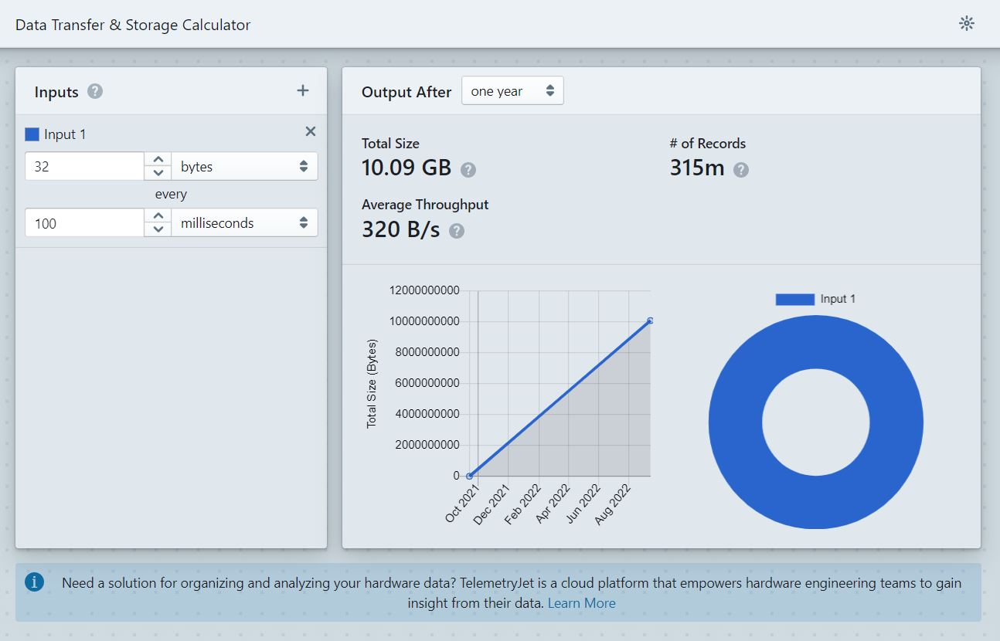

# Telemetry Data Transfer &amp; Storage Calculator
This is a small demo static React application that helps compute data transfer quantities for continuously streaming telemetry. It is deployed statically to Github pages.

